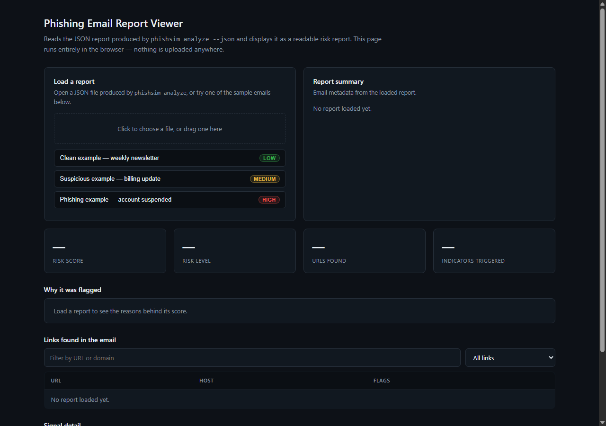
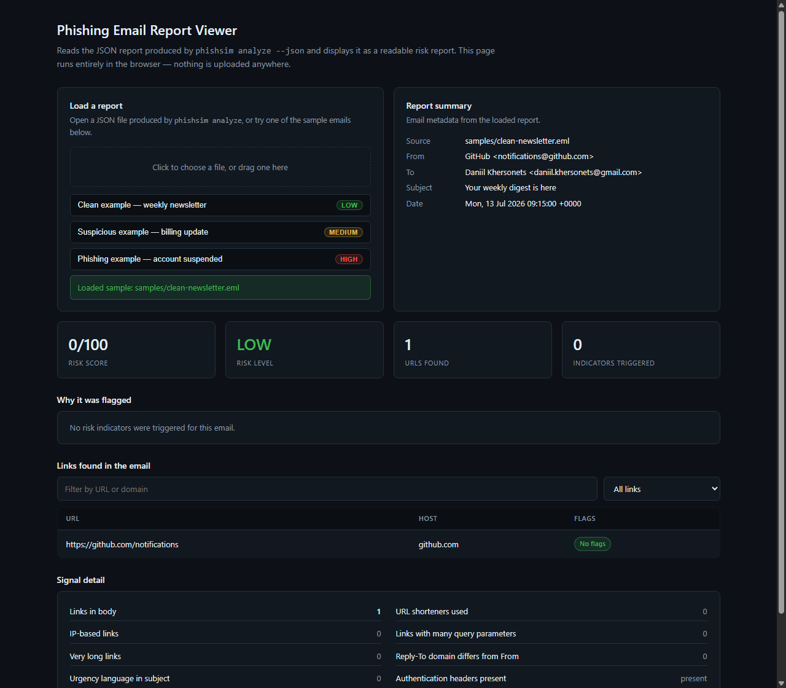
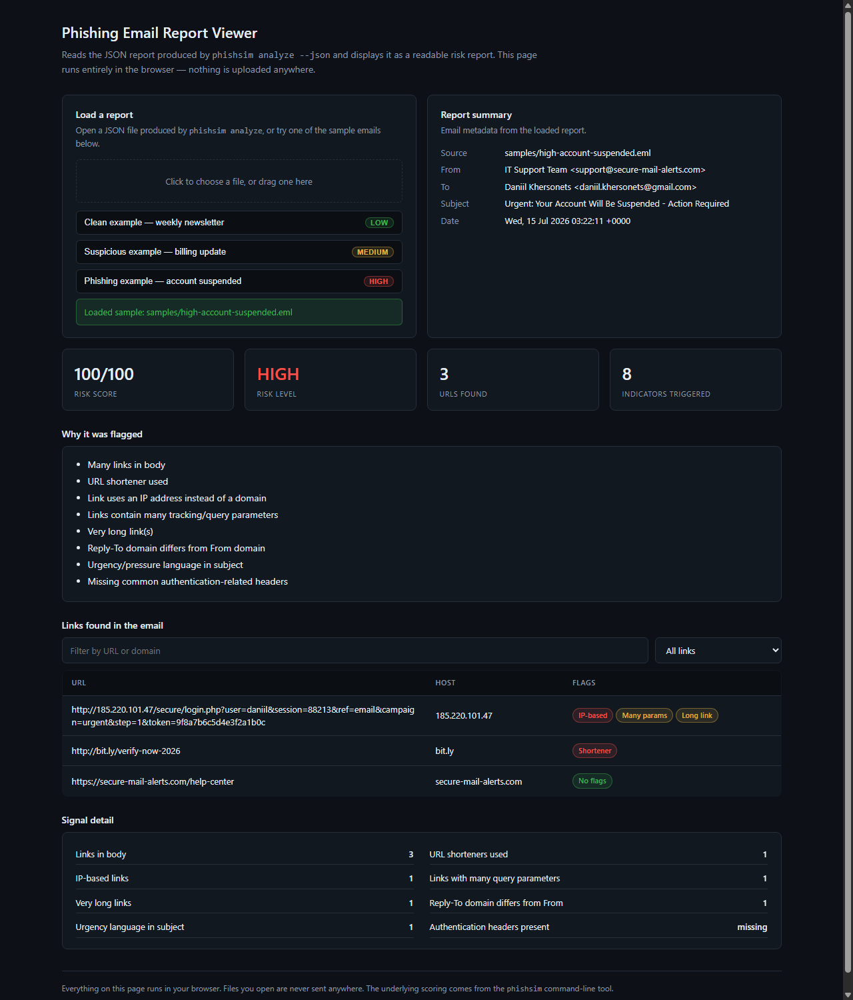

# Phishing Email Analyzer

A small Python tool that reads a `.eml` email file and scores how suspicious it looks, based on the
same kind of signals a SOC analyst checks by hand: shortened or IP-based links, a Reply-To address
that doesn't match the From address, urgency language in the subject, missing authentication
headers, and so on.

It's a detection tool, not an attack tool. It only reads the files you give it, never contacts
anything over the network, and doesn't generate or send phishing emails itself. It's meant for
security training, SOC skill-building, and email forensics practice.

## What it looks like

The repo includes a small browser-based viewer for the reports (`ui/index.html`). It's a single
static file — open it directly, no server or install required.

**Nothing loaded yet:**



**A clean email:**



**A phishing email:**



## Trying it without installing anything

Open [`ui/index.html`](ui/index.html) in a browser and click one of the three sample buttons
("Clean example", "Suspicious example", "Phishing example"). Each one loads a pre-generated report
from a real `.eml` file so you can see how the scoring behaves without touching the command line.

You can also drop in your own report: run the CLI with `--json` (see below) and load the resulting
file through the "Load a report" panel.

## Installing the CLI

```
git clone https://github.com/YOUR_USERNAME/sec-phishing-emails-sim.git
cd sec-phishing-emails-sim

python -m venv .venv
.venv\Scripts\activate        # Windows
source .venv/bin/activate     # macOS / Linux

python -m pip install -e .
```

This installs a `phishsim` command backed by the code in `src/phishing_sim`.

## Using the CLI

```
phishsim analyze samples/high-account-suspended.eml --pretty
```

```
Risk score: 100/100  |  Level: HIGH
Top reasons:
 - Many links in body
 - URL shortener used
 - Link uses an IP address instead of a domain
 - Links contain many tracking/query parameters
 - Very long link(s)
 - Reply-To domain differs from From domain
 - Urgency/pressure language in subject
 - Missing common authentication-related headers

URLs found:
 - http://185.220.101.47/secure/login.php?...
 - http://bit.ly/verify-now-2026
 - https://secure-mail-alerts.com/help-center
```

To write a JSON report instead of (or in addition to) the console summary:

```
phishsim analyze samples/high-account-suspended.eml --json report.json
```

That JSON file is what `ui/index.html` reads.

## How the score is calculated

Each email starts at 0 and picks up points for every signal it triggers. The score is capped at 100.

| Signal                                          | Points |
|--------------------------------------------------|-------:|
| Three or more links in the body                  |    +10 |
| A known URL shortener is used                     |    +20 |
| A link points to a raw IP address instead of a domain |  +25 |
| A link has an unusually long query string          |    +10 |
| A very long link (120+ characters)                 |    +5  |
| Reply-To domain differs from the From domain        |    +15 |
| Subject contains urgency language (verify, urgent, suspended, immediately, action required) | +10 |
| No common authentication headers present (`Authentication-Results`, `Received-SPF`, `DKIM-Signature`) | +10 |

| Score  | Level  |
|--------|--------|
| 0–39   | LOW    |
| 40–69  | MEDIUM |
| 70–100 | HIGH   |

This is a heuristic score, not a verdict. It's meant to highlight things worth a closer look, the
same way a first-pass triage would, not to replace one.

## Sample emails

Three example `.eml` files live under `samples/`, each written to land in a different risk band so
you can see the scoring model react to different signals:

| File                                | Level  | What's in it |
|--------------------------------------|--------|---------------|
| `clean-newsletter.eml`                | LOW    | A normal notification email with a legitimate link and valid auth headers |
| `medium-billing-update.eml`           | MEDIUM | Several tracking-heavy links and urgency wording, but no shortener or IP link |
| `high-account-suspended.eml`          | HIGH   | Shortened link, IP-based link, mismatched Reply-To, urgency language, and no auth headers |

Pre-generated JSON reports for all three are in `samples/reports/`, which is what the browser
viewer's sample buttons load.

## Project layout

```
sec-phishing-emails-sim/
├── pyproject.toml
├── README.md
├── LICENSE
├── src/
│   └── phishing_sim/
│       ├── cli.py
│       └── analyzer/
│           ├── parse_eml.py        # reads .eml files into a plain structure
│           ├── url_features.py     # link extraction and URL-based signals
│           ├── header_features.py  # header/metadata signals
│           ├── scoring.py          # turns signals into a score + reasons
│           └── report.py           # ties everything together into one report
├── samples/                        # example .eml files and their JSON reports
└── ui/
    └── index.html                  # standalone report viewer, no build step
```

## Limitations

- The scoring is a fixed set of heuristics, not a machine-learning model, and it will miss phishing
  emails that don't trip any of these specific signals.
- It only looks at what's inside the `.eml` file. It doesn't resolve domains, check link
  reputation, or verify SPF/DKIM/DMARC results — it just checks whether those headers exist.
- It's built and tested against `.eml` files exported from common mail clients. Other export
  formats may need conversion first.

## License

MIT, see [LICENSE](LICENSE).
